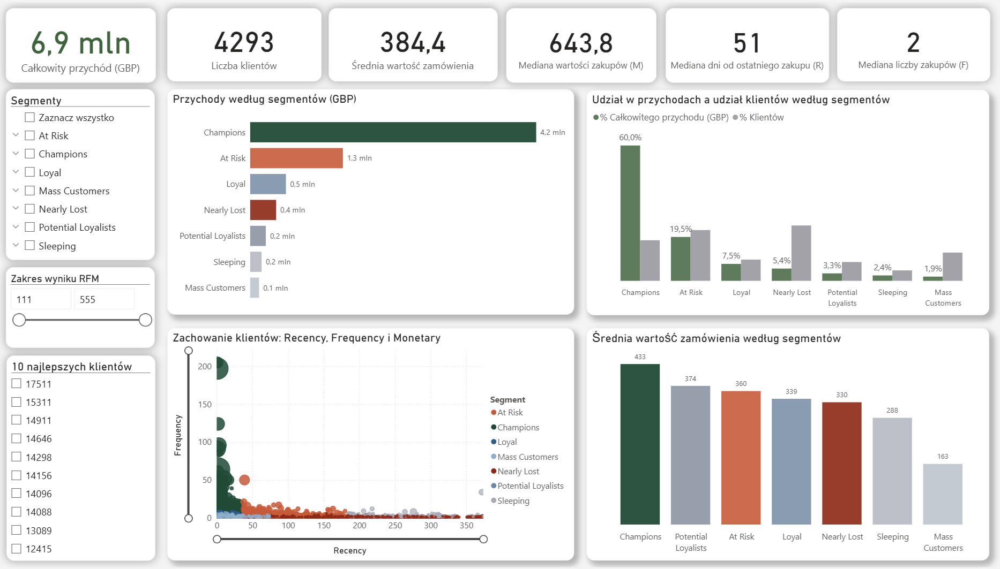

# Retail Customer Analytics (RFM Segmentation)

## Podsumowanie (Executive Summary)

Projekt prezentuje analizę klientów brytyjskiego sklepu internetowego opartą na danych transakcyjnych oraz segmentację metodą **RFM**, mającą na celu identyfikację segmentów o najwyższej wartości biznesowej i ryzyka utraty klientów.

Analiza wykazała silną koncentrację przychodów (18% klientów generuje 60% sprzedaży) oraz wysoki udział segmentów zagrożonych odpływem klientów (**47% bazy**). Na tej podstawie sformułowano rekomendacje dotyczące retencji, reaktywacji oraz rozwoju klientów o wysokim potencjale.

Projekt został wykonany jako kompleksowe studium analityczne end-to-end, pokazującym praktyczne zastosowanie SQL, Pythona oraz Power BI do wspierania decyzji biznesowych.

---

## 🎯 Cel projektu

Projekt koncentruje się na analizie zachowań klientów brytyjskiego sklepu internetowego w celu zrozumienia struktury przychodów oraz identyfikacji segmentów klientów o najwyższej wartości biznesowej.

**Cel biznesowy:**

* Zrozumienie struktury przychodów.
* Identyfikacja kluczowych segmentów klientów.
* Wskazanie grup o wysokim potencjale oraz obszarów ryzyka (utrata klientów).
* Opracowanie strategii pracy z różnymi grupami klientów.

**Cel projektowy (portfolio):**

* Pokazanie umiejętności analitycznych end‑to‑end (od danych surowych do wniosków biznesowych).
* Przygotowanie projektu demonstracyjnego do portfolio.
* Praktyczne doświadczenie i zastosowanie segmentacji RFM.
* Stworzenie czytelnego i użytecznego dashboardu w **Power BI**.

---

## :bar_chart: Dane

Analiza została oparta na publicznym zbiorze **Online Retail Dataset (Kaggle)**.

Charakterystyka danych:

* Dane transakcyjne sklepu internetowego z rynku **UK**.
* Okres: **2010–2011**.
* Waluta: **GBP**.

Na etapie przygotowania danych:

* Usunięto zwroty, ręczne korekty oraz rekordy niskiej jakości (brak CustomerID, wartości zerowe lub ujemne, brak informacji o produkcie).
* Odfiltrowano transakcje uniemożliwiające wiarygodną analizę klientów.
* Obliczono przychód na poziomie transakcji.

---

## :pushpin: Kluczowe wnioski biznesowe

1. **18% klientów generuje 60% całkowitych przychodów**
	* Przychody są silnie skoncentrowane w wąskiej grupie klientów o najwyższej wartości.
	* Wdrożenie programów lojalnościowych, ofert VIP oraz wcześniejszego dostępu do promocji.
	* Cel: utrzymanie stabilnej bazy przychodowej i ograniczenie ryzyka odpływu klientów w segmencie o najwyższej wartości.

2. **Segmenty At Risk oraz Nearly Lost** obejmują łącznie **2 021 klientów (47,1% bazy)** i generują **24,9% przychodów**.
	* Duża część klientów wykazuje spadek aktywności zakupowej, mimo istotnego wkładu w historyczne przychody.
	* Pilne kampanie reaktywacyjne (e-mail reminder, zniżki czasowe, oferty personalizowane), z priorytetem dla segmentu At Risk.
	* Cel: odzyskanie części przychodów i zmniejszenie skali odpływu klientów o średniej i wysokiej wartości.

3. **Potential Loyalists** mają drugi najwyższy średni koszyk (**374 GBP**), jednak generują tylko **3,3% przychodów**
	* Segment o wysokim potencjale wzrostu przy niskiej częstotliwości zakupów.
	* Cross-selling, rekomendacje produktowe, zachęty do zwiększenia częstotliwości zakupów.
	* Cel: rozwój segmentu i przekształcenie klientów w Loyal lub Champions.

4. **Mass Customers** charakteryzują się najniższym średnim koszykiem (**163 GBP**) i odpowiadają jedynie za **2% przychodów**.
	* Segment o niskiej rentowności i ograniczonym wpływie na wynik finansowy.
	* Automatyczne kampanie masowe oraz brak dedykowanych, kosztownych działań marketingowych.
	* Cel: minimalizacja kosztów obsługi przy zachowaniu podstawowej obecności marki.

---

## :chart_with_upwards_trend: Dashboard

Dashboard prezentuje interaktywną analizę segmentów klientów oraz ich wartości biznesowej.

Dashboard został zaprojektowany jako narzędzie wspierające szybkie decyzje biznesowe poprzez wizualne porównanie segmentów i ich wpływu na przychody. Umożliwia:

* identyfikację segmentów oraz monitorowanie ich wpływu na przychody,
* analizę struktury klientów i przychodów,
* porównanie segmentów RFM,
* szybkie przejście od ogólnego obrazu do szczegółów.

**Dashboard w Power BI nie został opublikowany online ze względu na ograniczenia konta edukacyjnego.
W folderze power_BI/ znajduje się plik `.pbix`, folder `screenshots/` oraz `README.md` z opisem kluczowych metryk.**

---

## :brain: Metodologia

W projekcie zastosowano analizę **RFM (Recency, Frequency, Monetary)** w celu segmentacji klientów na podstawie ich aktywności zakupowej i wartości biznesowej.

* **Recency** - jak dawno dokonali ostatniego zakupu,
* **Frequency** - jak często kupują,
* **Monetary** - jaką wartość generują.

Na tej podstawie klienci zostali przypisani do segmentów biznesowych (m.in. Champions, At Risk, Nearly Lost, Mass Customers, Potential Loyalists).

---

## :hammer_and_wrench: Wykorzystane technologie

* **Power BI** - model danych, miary DAX, dashboard
* **Python (Pandas)** - eksploracja i przygotowanie danych
* **PostgreSQL** - czyszczenie i walidacja danych
* **Docker, DBeaver, Visual Studio Code** - środowisko pracy

---

## :file_folder: Struktura projektu

* `data/`  
	- `rfm_table.csv` - finalna tabela segmentacji RFM  
	- `sample/` - przykładowe dane (raw i po czyszczeniu)  
	- `readme.md` - opis danych i procesu przygotowania  

* `sql/` - zapytania SQL według etapów analizy  
	- `01_przeglad/`  
	- `02_sprawdzenie_jakosci/`  
	- `03_eksploracja/`  
	- `04_analiza_biznesowa/`  

* `python/`  
	- `rfm_functions.py` - funkcje do obliczeń RFM i segmentacja

* `power_BI/`  
	- `vizualizacja.pbix` - dashboard Power BI  
	- `screenshots/` - zrzuty ekranu wizualizacji  
	- `readme.md` - opis dashboardu i metryk

* `.gitignore`  
* `README.md`
